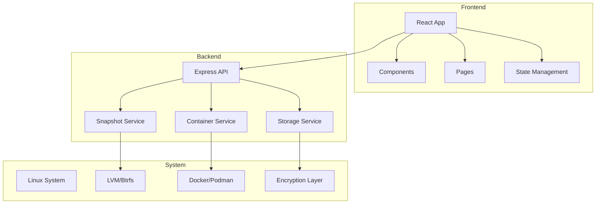
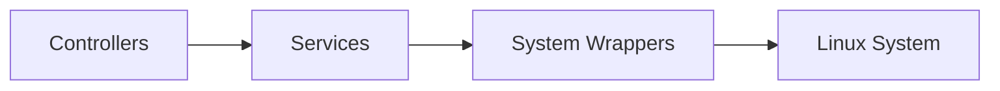
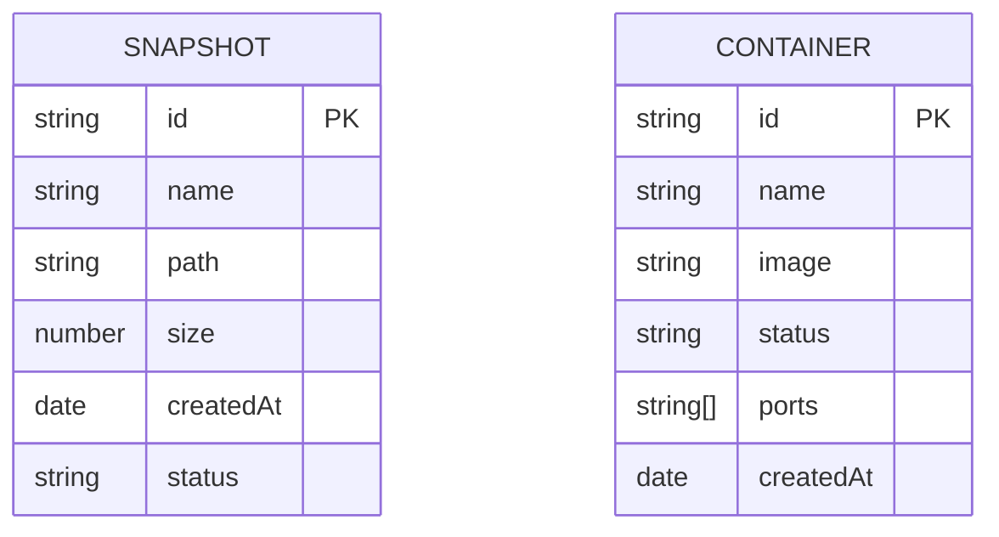

## 1. Architecture Design


## 2. Technology Description
- Frontend: React@18 + TypeScript + tailwindcss@3 + vite
- Initialization Tool: vite-init
- Backend: Express@4 + TypeScript
- System Integration: Linux system calls, Docker/Podman API

## 3. Route Definitions
| Route | Purpose |
|-------|---------|
| / | Dashboard page |
| /snapshots | Snapshots management page |
| /storage | Storage management page |
| /containers | Containers management page |
| /api/snapshots | Snapshots API |
| /api/storage | Storage API |
| /api/containers | Containers API |

## 4. API Definitions
```typescript
// Snapshot Types
interface Snapshot {
  id: string;
  name: string;
  path: string;
  size: number;
  createdAt: Date;
  status: 'available' | 'creating' | 'restoring';
}

// Storage Types
interface StorageStats {
  total: number;
  used: number;
  available: number;
  compressionRatio: number;
}

// Container Types
interface Container {
  id: string;
  name: string;
  image: string;
  status: 'running' | 'stopped' | 'created';
  ports: string[];
  createdAt: Date;
}

// API Endpoints
GET /api/snapshots: Snapshot[]
POST /api/snapshots: Snapshot
POST /api/snapshots/:id/restore: void
DELETE /api/snapshots/:id: void

GET /api/storage: StorageStats
POST /api/storage/compress: { success: boolean }
POST /api/storage/encrypt: { success: boolean }

GET /api/containers: Container[]
POST /api/containers: Container
POST /api/containers/:id/start: void
POST /api/containers/:id/stop: void
DELETE /api/containers/:id: void
```

## 5. Server Architecture Diagram


## 6. Data Model
### 6.1 Data Model Definition


### 6.2 Data Storage
- Application state managed via Zustand
- System state queried in real-time from Linux
- No persistent database needed for MVP
