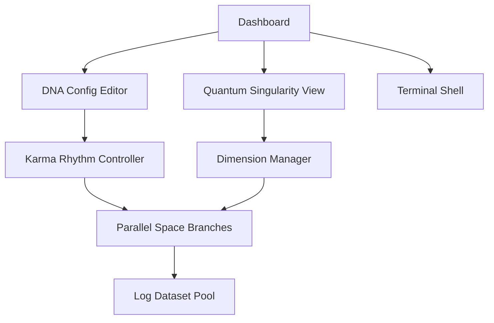

## 1. Product Overview
JMK-Dimension Studio 是一个融合理论物理、生物信息学、拓扑学和现代 Web 技术的多维科研 IDE 插件，旨在为科研人员提供量子因果可视化与高维数据探索平台。

## 2. Core Features

### 2.1 Feature Module
1. **Dashboard**: 3D科研空间全景展示、JMKmap维度图谱、时间轴控制
2. **Quantum Singularity View**: 量子奇点内存空间可视化、超弦生成与拓扑运算
3. **DNA Config Editor**: DNA式配置文件解析器、基因序列编辑与因果节律控制
4. **Dimension Manager**: 维度空间管理工具、空间密码加密系统、数据检索拓扑
5. **Terminal Shell**: 基因化终端交互、时间因果增量日志系统

### 2.3 Page Details
| Page Name | Module Name | Feature description |
|-----------|-------------|---------------------|
| Dashboard | 3D Space Viewer | WebGL 渲染的超弦网络、可交互缩放的多维空间 |
| Dashboard | JMKmap Spiral | 基于π圆周率的黄金螺旋维度图谱、熵值颜色编码 |
| Quantum Singularity View | Singularity Engine | 量子奇点初始化、维度量化与拓扑运算 |
| DNA Config Editor | DNA Parser | 解析ATCG碱基对配置、生成事件控制拓扑 |
| Dimension Manager | Admin Tool | 空间密码加密/解密、数据隐藏与检索 |
| Terminal Shell | Gene Terminal | DNA双螺旋滚动条、时间轴回放系统 |

## 3. Core Process
用户通过 Dashboard 进入多维科研空间，使用 DNA Config Editor 配置实验参数，在 Quantum Singularity View 中观察拓扑变化，通过 Terminal Shell 执行指令，所有因果事件自动记录并可视化展示。

## 4. User Interface Design
### 4.1 Design Style
- 主色调：深邃宇宙蓝 (#0a0f1a)、量子紫 (#7c3aed)、熵金黄 (#f59e0b)
- 辅助色：冷蓝低熵 (#3b82f6)、暖红高熵 (#ef4444)
- 按钮风格：3D 玻璃态、霓虹边框、脉冲动画
- 字体：Orbitron (标题)、JetBrains Mono (代码/终端)
- 布局风格：分形网格、层叠卡片、全息投影效果
- 图标风格：几何抽象、粒子轨迹、弦振动图案

### 4.2 Page Design Overview
| Page Name | Module Name | UI Elements |
|-----------|-------------|-------------|
| Dashboard | Hero Section | 全屏 3D 粒子弦背景、全息投影标题、动态熵值仪表 |
| Dashboard | JMKmap Spiral | 黄金螺旋布局、节点粒子系统、颜色渐变过渡 |
| Quantum Singularity View | Singularity Core | 径向光效、黑洞引力可视化、维度扭曲动画 |
| DNA Config Editor | Sequence Editor | 双螺旋滚动、碱基对配对高亮、拓扑连接线 |
| Terminal Shell | Gene Terminal | 霓虹控制台、DNA链滚动条、因果增量计数器 |

### 4.3 Responsiveness
Desktop-first，支持 1080p-4K 分辨率，科研级精确交互，针对大屏幕优化；移动端提供简化视图。

### 4.4 3D Scene Guidance
- 环境：深空星云 HDRI、低光氛围、引力透镜效果
- 光照：点光源 (量子奇点)、霓虹发光条、体积光
- 相机：轨道控制器、自由漫游模式、预设视角切换
- 交互：鼠标悬停高亮、拖拽创建弦、滚轮缩放维度
- 动画：弦振动循环、粒子流、维度呼吸效果
- 后处理： bloom 发光、景深、轻微噪点纹理
