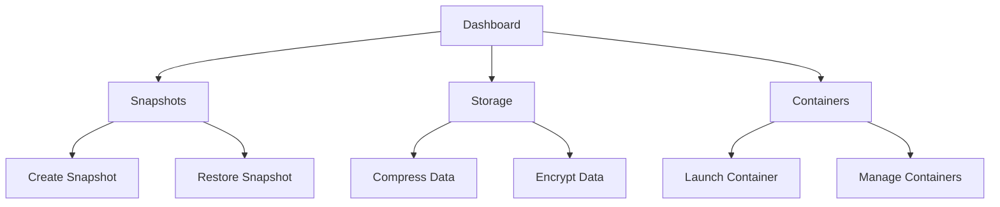

## 1. Product Overview
NAS Linux Server Management System - Comprehensive tool for managing NAS servers, mirror snapshots, compression, encryption, and virtual containers.
- Target users: System administrators, DevOps engineers, NAS users
- Solves problems: Efficient snapshot management, secure data compression/encryption, virtual container orchestration

## 2. Core Features

### 2.1 User Roles
| Role | Registration Method | Core Permissions |
|------|---------------------|------------------|
| Admin | Local authentication | Full access to all features |

### 2.2 Feature Module
1. **Dashboard**: System overview, statistics, quick actions
2. **Snapshots**: Create, list, restore, delete mirror snapshots
3. **Storage**: Compression and encryption management
4. **Containers**: Virtual container creation and management

### 2.3 Page Details
| Page Name | Module Name | Feature description |
|-----------|-------------|---------------------|
| Dashboard | System Stats | Display CPU, memory, storage usage in real-time |
| Dashboard | Quick Actions | One-click access to common operations |
| Snapshots | Snapshot List | View all snapshots with details |
| Snapshots | Create Snapshot | Form to create new snapshots with options |
| Storage | Compression | Manage compression settings and operations |
| Storage | Encryption | Configure encryption for data at rest |
| Containers | Container List | View and manage running containers |
| Containers | Create Container | Form to launch new containers |

## 3. Core Process
1. User logs into the dashboard
2. User navigates to desired module (Snapshots/Storage/Containers)
3. User performs operations (create, manage, restore)
4. System executes and provides feedback

## 4. User Interface Design
### 4.1 Design Style
- Primary: #0ea5e9 (sky blue), Secondary: #8b5cf6 (violet)
- Button style: Rounded, smooth transitions
- Font: Inter for body, Space Grotesk for headings
- Layout: Card-based with sidebar navigation
- Icon style: Modern linear icons from lucide-react

### 4.2 Page Design Overview
| Page Name | Module Name | UI Elements |
|-----------|-------------|-------------|
| Dashboard | Hero section | Gradient background, animated stats cards |
| Snapshots | List | Data table with status indicators |
| Storage | Settings | Form with toggle switches and sliders |
| Containers | Grid | Card-based container status display |

### 4.3 Responsiveness
- Desktop-first design
- Fully responsive to tablet and mobile
- Touch-friendly controls for mobile devices

